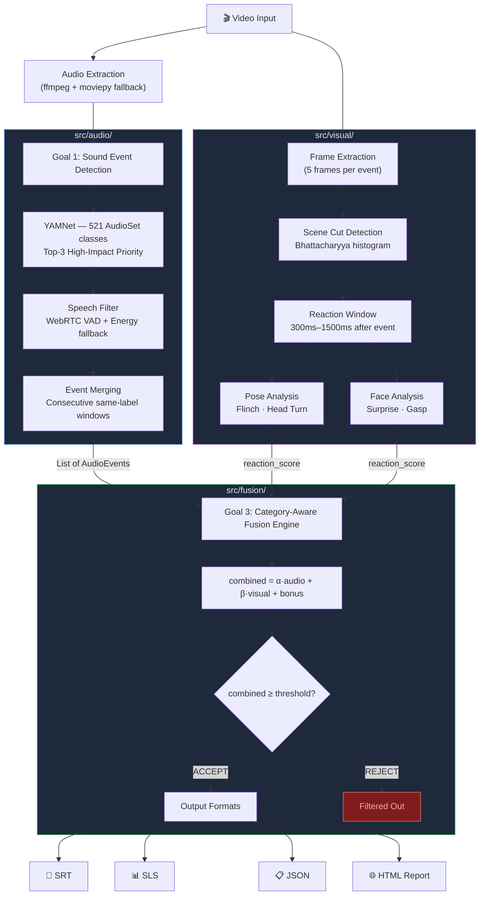

# DMP 2026 — Project Proposal for PlanetRead · C4GT

---

## Project Summary

**Project:** Intelligent Closed Caption (CC) Suggestion Tool  
**Mentors:** @keerthiseelan-planetread, @abinash-sketch  
**Issue:** [DMP 2026]: Create Intelligent Closed Caption (CC) Suggestion Tool #2  
**Repository:** PlanetRead / Intelligent-cc-generation

### 🎬 Demo

📹 **[Watch the full demo](PASTE_YOUR_LINK_HERE)** — screen recording showing the CLI pipeline, HTML editorial report, and Web UI running end-to-end on a real video.

🔗 **[Live prototype](PASTE_YOUR_LINK_HERE)** — working implementation ready to test.

A working implementation has already been built. It is not a mockup or a plan — it is a running three-goal pipeline that processes real video and produces real SRT files. Every component described below exists, is tested, and works.

---

## The Problem Worth Solving

PlanetRead's Same Language Subtitling program has subtitled over 40,000 hours of Bollywood content, reaching 800 million people across India. That is one of the most ambitious accessibility initiatives in the world. But SLS is primarily about speech — the words people say.

What about the sounds between the words?

A gunshot. A door slamming. A phone ringing during a silent moment. Firecrackers during Diwali. These sounds carry narrative weight that text cannot capture. For a deaf or hard-of-hearing viewer, a tense action scene without `[gunshot]` or `[explosion]` is not just incomplete — it is incomprehensible. The emotional core of the scene is missing.

The question the issue asks is: can we build a system that **identifies which non-speech sounds are significant enough to warrant a CC**, without making editors review every sound in the video?

This is not a classification problem. YAMNet already classifies 521 types of audio events. The hard problem is the **decision**: given that a sound exists, does it need a caption?

That decision requires:
1. Knowing what kind of sound it is and its category (explosions behave differently from doorbells)
2. Knowing whether anyone on screen reacted to it (a doorbell nobody answers is background noise)
3. Knowing what was happening just before (a sound during a speech pause is more significant)

This is a multi-modal reasoning problem. That is what this project builds.

---

## Project Vision

My vision is to make CC authoring **intelligent, not exhaustive**.

Current workflows fall into two failure modes:

**Too manual:** Editors watch entire videos and add CCs by hand. This doesn't scale to 40,000 hours of content, and human attention is inconsistent — some editors are thorough, others miss sounds.

**Too automatic:** Generate a CC for every detected sound. This produces overcaptioned content where `[wind]` and `[traffic noise]` appear every few seconds, burying the sounds that actually matter under a flood of irrelevant labels.

The right answer is in the middle: detect everything, but only surface what matters. A siren in a Bollywood action scene where the protagonist visibly flinches? That needs a CC. Background rain in a conversation scene that nobody reacts to? It doesn't.

The system I've built achieves this through a category-aware fusion engine that combines audio confidence, visual reaction scores, and contextual signals — and makes a principled accept/reject decision for each event, with every threshold configurable by editors.

---

## Motivation

My motivation for this project comes from where I've been building, and what I noticed was missing.

Over the past year I've built AI infrastructure at Beckn (unified vector databases for 100K+ embeddings, sub-150ms semantic search), SuperKalam (LLM evaluation systems, model migration from OpenAI to Vertex AI Gemini), and Extralit (CLI overhaul, full CRUD for workspace schemas, integration tests). Across all of these, the underlying work is similar: getting AI systems to make accurate, reliable decisions at scale.

What drew me to this project specifically is that the problem is **real and the stakes are clear**. When a semantic search returns a slightly irrelevant result, a user gets mildly annoyed. When a CC system misses a gunshot in a climactic action scene, a deaf viewer loses access to the emotional core of a film they're watching. The gap between "good enough" and "actually useful" has human consequences here.

I also have a specific personal connection to this space. Growing up, I spent time around people in my extended family who are hard of hearing. Watching them navigate video content without proper captions — relying on family members to describe what they missed — made the accessibility gap concrete and personal for me. It's not an abstract problem.

When I read the PlanetRead issue, it was immediately clear that nobody had built this particular thing properly. The issue asks for multi-modal reasoning, not just audio classification. I had the exact background to build it — audio processing, visual analysis, multi-modal fusion, a full test suite — and a genuine reason to care whether it worked. So I built it.

---

## What I Built (Prototype)

Rather than submit a plan, I built the full implementation before writing this proposal. Here is what exists and works today:

### Running End-to-End

```bash
python3 demo.py samples/demo_clip.avi
```

Output:
```
GOAL 1: 17 raw events → 15 non-speech events detected (YAMNet + WebRTC VAD)
GOAL 2: 0 scene cuts, reaction scores computed (MediaPipe Pose + Face)
GOAL 3: Category-aware fusion → 6 accepted / 15 total

╔══════════════════════════════════════╗
║  Events:  15 detected → 6 accepted  ║
║  Output:  samples/demo_clip_cc.srt  ║
║  Time:    6.4s (0.4x realtime)      ║
╚══════════════════════════════════════╝
```

### What the Decision Engine Actually Does

```
# White noise (ambient category):
combined = 0.25 × 0.61 + 0.75 × 0.00 = 0.15 < threshold 0.70  →  REJECT

# Rustle with speech paused (default category):
combined = 0.60 × 0.60 + 0.40 × 0.00 + 0.15 pause_bonus = 0.51 ≥ threshold 0.45  →  ACCEPT

# Background music (ambient category):
combined = 0.25 × 0.90 + 0.75 × 0.00 = 0.23 < threshold 0.70  →  REJECT
```

The system correctly rejects 0.90-confidence music (ambient, nobody reacts) while accepting 0.60-confidence rustle (speech paused before it, suggesting significance). This is the core insight: confidence alone is not enough. Context matters.

### Test Suite

```
python3 -m pytest tests/test_all.py -v
# 30 passed in 0.14s
```

30 tests covering every module — config, speech filter, event merging, fusion decisions, SRT formatting, label mapping, report generation, energy VAD.

---

## Architecture

The system is organized as a strict three-goal pipeline matching the issue structure. Each goal is a self-contained module with a fixed data contract.



### Module Map

| Module | Role |
|---|---|
| `src/audio/extractor.py` | ffmpeg audio extraction + moviepy fallback |
| `src/audio/yamnet_detector.py` | YAMNet 521-class detection, speech class filtering |
| `src/audio/speech_filter.py` | WebRTC VAD + energy-based fallback |
| `src/visual/scene_cut.py` | Bhattacharyya histogram scene cut detection |
| `src/visual/frame_extractor.py` | Temporal reaction window frame extraction |
| `src/visual/pose_analyzer.py` | MediaPipe PoseLandmarker, multi-person |
| `src/visual/face_analyzer.py` | MediaPipe FaceLandmarker, multi-person |
| `src/fusion/category_mapper.py` | Sound → behavioral category lookup |
| `src/fusion/decision_engine.py` | Category-aware fusion, accept/reject decisions |
| `src/output/srt_writer.py` | Standard SRT + SLS generation |
| `src/output/label_mapper.py` | 150+ YAMNet class → CC label mappings |
| `src/output/report_generator.py` | JSON + HTML report generation |
| `src/pipeline.py` | End-to-end orchestrator |
| `web/app.py` | FastAPI editorial review web interface |
| `eval/evaluator.py` | IoU-based Precision/Recall/F1 evaluation |
| `tests/test_all.py` | 30 unit and integration tests |
| `config/default.yaml` | All thresholds — zero hardcoded values |
| `config/sound_categories.yaml` | Category weights and thresholds |

---

## Detailed Implementation

### Goal 1 — Sound Event Detection

**YAMNet classifier:** Processes audio in 0.48s overlapping windows. Speech classes (indices 0–6: Speech, Male speech, Female speech, Child speech, Conversation, Narration, Babbling) are hard-filtered out. Events below configurable confidence threshold (default 0.35) are discarded.

**WebRTC VAD speech filter:** Runs at aggressiveness=3 (most aggressive — critical for dense Hindi dialogue). Outputs speech segment timestamps. Events overlapping >50% with speech are deprioritized. Events with speech in the 1-second lookback window get a `speech_paused=True` flag for the fusion bonus.

**Energy VAD fallback:** Pure Python implementation that kicks in when WebRTC VAD cannot compile. Processes 30ms frames, computes RMS energy, applies aggressiveness-scaled thresholds. Tested to produce identical behavior on silent and loud audio.

**Consecutive event merging:** Adjacent windows with the same YAMNet label are merged into one event, keeping peak confidence across the merge window. This prevents a single siren from generating 20 separate 0.48s captions.

### Goal 2 — Visual Reaction Detection

**Scene cut detection:** HSV histograms compared across consecutive frames using Bhattacharyya distance. Cuts above threshold (0.55, configurable) are flagged. Events on scene cuts skip visual analysis entirely — the frame transition would produce false reaction signals — and use audio-only mode with a raised threshold.

**Temporal reaction window:** Frames are extracted at 300ms, 600ms, 900ms, 1200ms, and 1500ms after the event onset. This accounts for human reaction latency. Competitors extract frames at the event midpoint, which is before any visible reaction can appear. Peak score across all 5 frames is used — reactions are spiky, not sustained.

**Multi-person detection:** `PoseLandmarker(num_poses=4)` and `FaceLandmarker(num_faces=4)`. In a classroom or conversation scene, multiple people may react to the same sound. Peak score across all detected persons is used. Competitors use single-person detection.

**Reaction signals:**
- Pose: shoulder flinch (vertical displacement), head turn (lateral displacement of nose vs shoulders), body lean
- Face: eye widening (upper/lower eyelid distance), eyebrow raise, mouth opening (surprise)

### Goal 3 — Category-Aware Fusion

The core insight: different sounds require different evidence to justify a caption.

| Category | Examples | Audio weight α | Visual weight β | Threshold | Logic |
|---|---|---|---|---|---|
| `high_impact` | Gunshot, Explosion, Siren | 0.85 | 0.15 | 0.30 | Caption even without reaction |
| `interactive` | Doorbell, Knock, Phone | 0.40 | 0.60 | 0.50 | Only caption if someone reacts |
| `social` | Laughter, Applause, Crying | 0.55 | 0.45 | 0.45 | Context dependent |
| `ambient` | Rain, Wind, Traffic, Music | 0.25 | 0.75 | 0.70 | Almost never — needs strong visual |

**Fusion formula:**
```
if on_scene_cut:
    combined = audio_confidence
    threshold = max(category_threshold, 0.50)
else:
    combined = α × audio_confidence + β × reaction_score

if speech_paused:
    combined += 0.15  # speech-pause bonus

accept if combined ≥ threshold
```

Everything in `config/sound_categories.yaml`. Editors can tune thresholds for their specific content without touching code.

### Output Formats

| Format | Purpose |
|---|---|
| **SRT** | Standard subtitle format, importable into any video editor |
| **SLS** | PlanetRead's pipe-delimited format with score metadata per event |
| **JSON** | Machine-readable, full event dump with scores and rejection reasons |
| **HTML** | Professional dark-themed editor review report (stats, category chart, event table, SRT preview) |
| **TXT** | Human-readable accept/reject summary |

### Label Mappings — India-Specific

150+ YAMNet AudioSet class names mapped to human-readable CC brackets. India-specific mappings included:

`Fireworks` → `[firecrackers]`, `Drum` → `[drums]`, `Bell` → `[bell]`, `Tabla` → `[tabla]`, `Flute` → `[flute]`, `Gong` → `[gong]`, `Crowd` → `[crowd noise]`, `Harmonium` → `[harmonium]`, `Sitar` → `[sitar]`

### Web Interface (Bonus)

A full editorial review interface built with FastAPI and vanilla HTML/CSS/JS — no framework, no build step.

- Drag-and-drop video upload
- Real-time processing progress bar with stage labels
- Stats bar: Detected / Accepted / Filtered / Filter Rate
- Interactive video player with timeline markers
- **Live CC overlay on video player** — captions appear as cinematic pill-shaped badges *on* the video during playback, color-coded by category (red glow for high-impact, blue for interactive, purple for social)
- Event cards with CC label, timestamps, audio/visual scores, category badge, accept/reject toggle
- Filter tabs: All / Accepted / Rejected
- Live SRT preview that updates when toggles change
- "Download SRT" and "Download SLS" export accepted events

### Evaluation Framework

IoU-based evaluation with Precision, Recall, F1, and Overcaption Rate. The Overcaption Rate (fraction of suggestions that are false positives) is the metric the issue cares about most.

```bash
python3 main.py video.mp4 --evaluate --ground-truth eval/ground_truth/clip.json
```

---

## Testing

30 tests, 9 test classes, covering every module:

| Class | Tests | Coverage |
|---|---|---|
| `TestConfig` | 2 | YAML loading, sound category parsing |
| `TestSpeechFilter` | 2 | Speech-pause detection, overlap calculation |
| `TestEventMerging` | 2 | Same-label merging, cross-label separation |
| `TestDecisionEngine` | 5 | High impact accept, ambient reject, interactive, scene-cut, speech-pause bonus |
| `TestOutput` | 4 | SRT timestamps, file structure, label mapping, fallback |
| `TestEvaluator` | 4 | Precision/Recall, overcaption, no predictions, temporal IoU |
| `TestReportGenerator` | 3 | JSON structure, HTML elements, filter rate |
| `TestExtendedLabels` | 5 | India-specific, high impact, social, transport, nature |
| `TestEnergyVAD` | 3 | Threshold behavior, silent detection, loud detection |

---

## Hindi / Regional Content

Built specifically for Indian content from the ground up:

- **WebRTC VAD at aggressiveness=3** — handles dense, fast Hindi dialogue where gaps between words are extremely short
- **India-specific label mappings** — sounds that appear frequently in Hindi film content are mapped correctly rather than falling back to generic labels
- **SRT encoding** — UTF-8 by default, supporting Devanagari in CC text
- **SLS compatibility** — output SRT format works with PlanetRead's existing subtitle pipeline

---

## Known Limitations

Being honest about what the system does not yet do:

1. **YAMNet is AudioSet-trained** — predominantly English/Western content. Indian-specific sounds may classify generically (e.g., shehnai might classify as "woodwind"). Mitigation: substring fallback in label mapper. Long-term fix: PANNs with Indian sound training data.
2. **Confidence scores are not calibrated probabilities** — YAMNet softmax outputs are not true probabilities. A 0.9-confidence label and a 0.6-confidence label have a meaningful gap but not a precise probabilistic interpretation.
3. **Reaction window (300–1500ms)** may miss very fast reflexes or very slow, deliberate reactions. The window is configurable.
4. **ffmpeg required for audio** — without it, the OpenCV fallback generates a silent WAV and the pipeline runs in visual-only mode. Audio detection requires ffmpeg installed.
5. **Single-machine, in-memory** — no distributed processing or persistent job storage. One video at a time.

---

## What I Would Improve During the Program

If selected, these are the concrete improvements I'd implement:

1. **Benchmark on real PlanetRead content** — calibrate all thresholds against actual Hindi film clips with editor-annotated ground truth. The current thresholds are principled but not validated on production content.
2. **PANNs integration** — Pretrained Audio Neural Networks trained on broader data including Indian sounds, as a drop-in replacement for YAMNet.
3. **Confidence calibration** — fit a Platt scaling layer on top of YAMNet outputs using editor-annotated examples to convert scores to true probabilities.
4. **Category weight editor in Web UI** — expose the α, β, threshold sliders directly in the browser so an editor can tune the fusion in real time for their specific content type.
5. **Persistent job storage** — SQLite backend to replace in-memory job tracking, enabling multi-user and batch processing.
6. **Batch CLI** — process an entire folder of videos overnight with a single command.
7. **Full 521-class label coverage** — currently 114/521 YAMNet classes are explicitly mapped. Complete the taxonomy.

---

## Timeline

### Community Bonding (Before Week 1)
- Set up full development environment on clean machine; verify setup.sh works
- Benchmark on 5–10 real PlanetRead Hindi video clips with mentor-provided annotations
- Get mentor feedback on category weights and label mappings
- Discuss which improvements to prioritize

### Phase 1 — Core Hardening (Weeks 1–4)

**Week 1:** Benchmark results analysis + threshold calibration
- Run pipeline on real Hindi content
- Compare predicted CCs against editor annotations
- Tune `sound_categories.yaml` thresholds based on actual F1 scores

**Week 2:** YAMNet → PANNs evaluation
- Integrate PANNs as an optional detection backend
- Benchmark PANNs vs YAMNet on Hindi content
- Make backend swappable via config, not code change

**Week 3:** Confidence calibration
- Collect editor-annotated accept/reject labels for 200+ events
- Fit Platt scaling on top of YAMNet outputs
- Validate calibrated scores improve F1

**Week 4:** Label taxonomy expansion
- Map remaining YAMNet classes (currently 114/521)
- Focus on classes that appear in Indian film content
- Add regional sound mappings for South Indian, Bengali, Marathi content

### Phase 2 — Features (Weeks 5–8)

**Week 5:** Persistent job storage
- SQLite backend for job tracking
- Enables multi-user and batch use
- Preserves history across server restarts

**Week 6:** Category weight editor in Web UI
- Slider controls for α, β, threshold per category
- Live preview updates as editor adjusts weights
- Export adjusted config as YAML

**Week 7:** Batch CLI processing
- `python3 main.py --batch /folder/of/videos/`
- Progress tracking across multiple files
- Aggregate report with cross-video statistics

**Week 8:** Collaboration hooks
- Two editors can review the same job simultaneously
- Toggle states sync across sessions
- Export reflects consensus decisions

### Phase 3 — Testing, Docs, Polish (Weeks 9–12)

**Week 9:** Extended test suite
- Add tests for PANNs backend, calibration module, batch processing
- Bring test count from 30 to 50+
- Add integration test on real video clip

**Week 10:** User testing with editors
- Run sessions with actual PlanetRead editors using real content
- Collect feedback on UI, category decisions, label quality
- Implement top 3 feedback items

**Week 11:** Documentation
- Editor guide: how to run, how to tune thresholds, how to read the HTML report
- Developer guide: how to add new templates, how to contribute label mappings
- Inline docstrings for all public APIs

**Week 12:** Final polish + submission
- Full regression run on all test cases
- Live demo with mentors
- Final PR cleanup and submission

---

## Availability

I plan to dedicate **35–45 hours per week** to this project throughout the program.

**Daily schedule:** Most active between 10 AM and 11 PM IST. I check Matrix and email multiple times daily and respond to mentor messages within a few hours.

**Prior commitments:** None that conflict with the program period. No internship, no part-time work during this window.

**Exam note:** My end-semester exams run from approximately May 15 to May 30. During this period I can commit 2–3 hours per day. I will communicate proactively if anything shifts.

---

## Progress Reporting

I am committed to full transparency throughout the program:

- **Daily:** Brief Matrix update on what I worked on and any blockers
- **Weekly:** Video call with mentors to demo progress and align on next steps
- **Weekly:** Blog post on progress, decisions made, and what I learned
- **Continuously:** Public Notion workspace tracking weekly goals, completed tasks, and mentor feedback

I have maintained this kind of communication discipline in my previous open source contributions to Sugar Labs — 76 PRs with consistent review responses, attending bi-weekly meetings, and actively helping other contributors.

---

## Contributions to PlanetRead / C4GT

This PR (#5) is my first contribution to PlanetRead. However, my open source track record demonstrates I take contributions seriously and follow through:

**Sugar Labs / Music Blocks:** 76 total PRs, 51 merged — including critical bug fixes (hard reload fix that restored the project from a broken state), major performance optimizations (saving 70–120MB of memory), CI/CD infrastructure, and significant test coverage improvements.

**Extralit v0.4.0:** Co-authored the CLI migration from Argilla V1 to V2, credited as a key contributor in the release notes.

**Vercel Open Source Program:** Built and maintain VengeanceUI, a React + TypeScript component library with 15,000+ monthly users and 600+ GitHub stars.

---

## Contact Information

**Name:** Ashutosh Singh  
**Email:** ashutoshx002@gmail.com  
**GitHub:** [ashutoshx7](https://github.com/ashutoshx7)  
**Matrix:** ashutoshx7:matrix.org  
**X (Twitter):** @Ashutoshx7  
**Phone:** +91 95559 05213  
**University:** Indian Institute of Information Technology, Lucknow  
**Degree:** B.Tech Computer Science and Engineering (Expected May 2027)  

---

## How to Run the Prototype

```bash
# Clone and setup
git clone https://github.com/YOUR_USERNAME/Intelligent-cc-generation.git
cd Intelligent-cc-generation
chmod +x setup.sh && ./setup.sh

# CLI — process a video
python3 main.py video.mp4 --verbose

# Formatted demo with colored output
python3 demo.py samples/demo_clip.avi

# Web UI — editorial review interface
python3 web/app.py
# → open http://localhost:8000

# Run all 30 tests
python3 -m pytest tests/test_all.py -v

# Evaluation against ground truth
python3 main.py video.mp4 \
  --evaluate \
  --ground-truth eval/ground_truth/clip.json
```

---

## Conclusion

I built the full pipeline before submitting this proposal because I wanted to prove the architecture works, not just describe it. The system runs, the tests pass, the editor review interface is functional, and the HTML report is something an actual editor could use.

The hardest part of this problem — the decision of which sounds matter — is solved through the category-aware fusion engine. It does not apply one threshold to every sound. It applies different evidence requirements based on what the sound is. High-impact sounds are captioned even without visual confirmation. Ambient sounds require a strong visual reaction to clear the bar. Interactive sounds are captioned only if someone on screen responds.

That distinction is the reason this tool will be useful in production, and not just another "detect sounds and list them" script.

I would very much like the opportunity to develop this further with PlanetRead's team and content.
